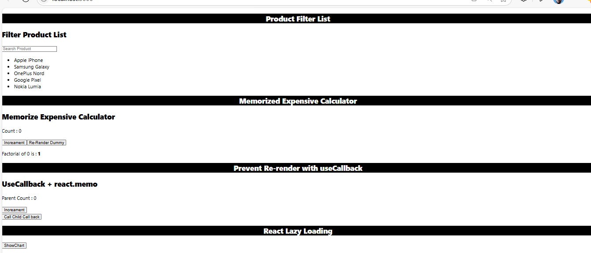
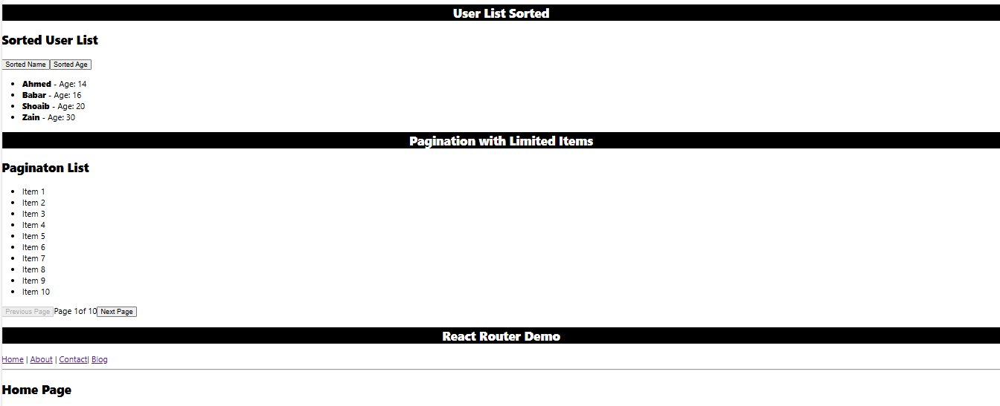
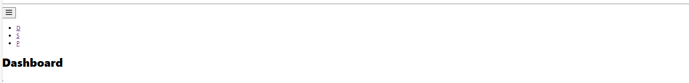

# React Practice Challenges – Level 4

This repository contains 10 advanced React.js challenges (Level 4), focused on modern UI logic, advanced hooks, performance optimization, routing, and reusable patterns.

**Live App:**  
[View the Live App](https://muhammadshoaib20.github.io/React_Level_04/)

---

## 📸 App Preview





---

## ✅ List of Level 4 Challenges

| #   | Challenge Name                    | Key Concepts Used                                           |
|-----|----------------------------------|--------------------------------------------------------------|
| 1️⃣ | Dynamic Routing with Params      | `react-router`, `useParams`, dynamic rendering              |
| 2️⃣ | 404 Page Handling                 | Fallback routes, conditional rendering                      |
| 3️⃣ | Lazy Loaded Component            | `React.lazy`, `Suspense`, code-splitting                    |
| 4️⃣ | Filterable Product List          | `useState`, filter logic, reusable components               |
| 5️⃣ | Sorted List (By Name/Age)        | Sorting logic, immutability, user events                    |
| 6️⃣ | Responsive Sidebar with Routing  | Sidebar layout, `NavLink`, active styles, toggle collapse   |
| 7️⃣ | useEffect Timer Concept          | `useEffect`, `setInterval`, cleanup function                |
| 8️⃣ | Pagination with Limited Items    | Array slicing, page state, next/prev logic                  |
| 9️⃣ | Tab Switching UI                 | `useState`, tab management, conditional rendering           |
| 🔟 | useReducer for Auth/Login State   | `useReducer`, global state, login/logout system             |

---

## 🧪 How to Run Locally

```bash
git clone https://github.com/MuhammadShoaib20/React-Challenges-level-04.git
cd React-Challenges-level-04
npm install
npm run dev

```
---

##  Deployment

This project is deployed using **GitHub Pages** with the help of the `gh-pages` package.

###  Steps to Deploy

```bash
npm install
npm run build
npm run deploy
```

---


###  Live App

[https://muhammadshoaib20.github.io/React_Level_04/](https://muhammadshoaib20.github.io/React_Level_04/)


---

## Author

👤 **Muhammad Shoaib**  
💼 [GitHub Profile](https://github.com/MuhammadShoaib20)

---

## ⭐️ Give it a Star

If you found this repository helpful, consider giving it a ⭐ on GitHub.
It helps others discover it and motivates me to build more cool stuff!


🌟 [Star this repo](https://github.com/MuhammadShoaib20/React_Level_04)
